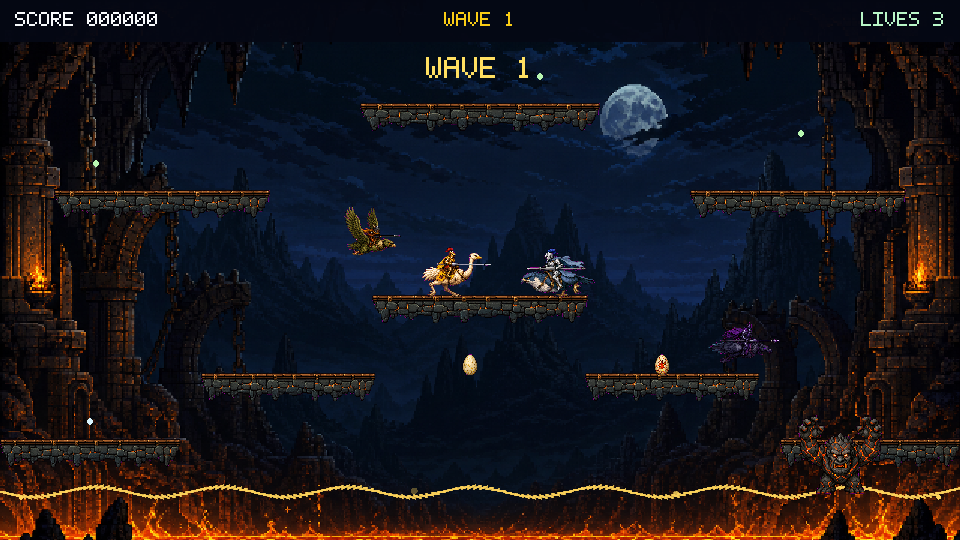

# Joustix

Joustix is a fast flying-joust arcade game built for
[Kilix](https://github.com/itsmygithubacct/kilix) and other Linux terminals
that implement the Kitty graphics protocol. It renders a software framebuffer
directly in the terminal: no desktop window, SDL, X11, or ncurses.

Ride your ostrich above enemy buzzard riders, collide from the higher position,
and collect the eggs they drop before they hatch. Clear increasingly difficult
waves while avoiding the lava below.



## Features

- Responsive acceleration, forgiving momentum, flapping, landing, underside
  bumps, and horizontal wrap
- Bounder, Hunter, and Shadow Lord AI with distinct speed and aggression
- Height-based jousts, tie rebounds, eggs, hatching, lives, scoring, and waves
- Original generated 16-bit sprite sheets for every rider class, including
  four-frame ground runs plus glide/flap/dive poses, as well as eggs, the lava
  troll, modular platforms, a moonlit volcanic stage, and a dedicated defeat
  scene
- Animated lava accents, particles, spawn effects, and screen shake
- Layered procedural arcade sound streamed to `pacat`, `pw-play`, `aplay`, or
  SoX `play`
- Resize-safe 16:9 playfield, flicker-free Kitty image double buffering, and
  asynchronous zlib/base64 presentation
- Deterministic headless game and render tests

## Build and run

Joustix needs Linux, a C11 compiler, zlib development headers, `make`, and a
Kitty-protocol terminal.

```sh
make
./joustix
```

Kilix is the primary target. Kitty, Ghostty, recent Konsole releases, and
WezTerm should also work, although multiplexer passthrough can vary.

On Debian or Ubuntu, the build dependencies are:

```sh
sudo apt install build-essential zlib1g-dev
```

Audio is optional. If no supported command-line sink is installed, the game
runs silently.

## Controls

| Key | Action |
|---|---|
| Left / A | Fly left |
| Right / D | Fly right |
| Up / W / Space | Flap |
| P / Esc | Pause / resume |
| M | Toggle sound |
| Enter | Start, continue, or restart |
| Q | Quit |

The terminal delivers key-repeat events rather than key-up events. Joustix uses
a short input latch so taps work immediately and held direction keys remain
smooth when the terminal begins repeating them.

## Development

```sh
make test
./joustix --selftest 1337 12000
JOUSTIX_RENDER_DIR=/tmp/joustix-shots ./joustix --render-test 7
./joustix --sound-test
```

Set `JOUSTIX_SKIP_PROBE=1` only to bypass the startup graphics query when you
already know the terminal forwards Kitty graphics. See
[`docs/kilix-integration.md`](docs/kilix-integration.md) for Kilix 95 Games
menu integration and local-install details.

`JOUSTIX_ASSETS=/path/to/assets` overrides production-image discovery for
packaging tests. Normal checkout and installed layouts are detected
automatically.

## Architecture

| File | Role |
|---|---|
| `src/game.c` | physics, AI, collision, waves, eggs, hazards, input |
| `src/render.c` | RGBA software rasterizer, embedded 5x7 font, keyed sprite atlases |
| `src/term.c` | raw input and threaded Kitty framebuffer presentation |
| `src/sound.c` | procedural effects, live mixer, optional audio sink |
| `src/main.c` | interactive loop, CLI, selftests, snapshot tests |

The runtime image inventory and public-release provenance are documented in
[`docs/asset-sources.md`](docs/asset-sources.md). Joustix is an original
implementation inspired by the flying-joust arcade genre. It does not include
assets or code from the commercial arcade game.

## License

MIT. See [LICENSE](LICENSE).
